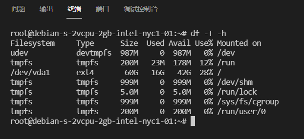

# 191180164 杨茂琛 实验4

## 查看文件系统

使用命令：

```
$ df -T -h
```

显示如下：



可以看到使用的是ext4文件系统

## 阅读源码

inode数据结构位于/include/linux/fs.h中：

```
struct inode {
	umode_t			i_mode;
	unsigned short		i_opflags;
	kuid_t			i_uid;
	kgid_t			i_gid;
	unsigned int		i_flags;

#ifdef CONFIG_FS_POSIX_ACL
	struct posix_acl	*i_acl;
	struct posix_acl	*i_default_acl;
#endif

	const struct inode_operations	*i_op;
	struct super_block	*i_sb;
	struct address_space	*i_mapping;

#ifdef CONFIG_SECURITY
	void			*i_security;
#endif

	/* Stat data, not accessed from path walking */
	unsigned long		i_ino;
	/*
	 * Filesystems may only read i_nlink directly.  They shall use the
	 * following functions for modification:
	 *
	 *    (set|clear|inc|drop)_nlink
	 *    inode_(inc|dec)_link_count
	 */
	union {
		const unsigned int i_nlink;
		unsigned int __i_nlink;
	};
	dev_t			i_rdev;
	loff_t			i_size;
	struct timespec64	i_atime;
	struct timespec64	i_mtime;
	struct timespec64	i_ctime;
	spinlock_t		i_lock;	/* i_blocks, i_bytes, maybe i_size */
	unsigned short          i_bytes;
	unsigned int		i_blkbits;
	enum rw_hint		i_write_hint;
	blkcnt_t		i_blocks;

#ifdef __NEED_I_SIZE_ORDERED
	seqcount_t		i_size_seqcount;
#endif

	/* Misc */
	unsigned long		i_state;
	struct rw_semaphore	i_rwsem;

	unsigned long		dirtied_when;	/* jiffies of first dirtying */
	unsigned long		dirtied_time_when;

	struct hlist_node	i_hash;
	struct list_head	i_io_list;	/* backing dev IO list */
#ifdef CONFIG_CGROUP_WRITEBACK
	struct bdi_writeback	*i_wb;		/* the associated cgroup wb */

	/* foreign inode detection, see wbc_detach_inode() */
	int			i_wb_frn_winner;
	u16			i_wb_frn_avg_time;
	u16			i_wb_frn_history;
#endif
	struct list_head	i_lru;		/* inode LRU list */
	struct list_head	i_sb_list;
	struct list_head	i_wb_list;	/* backing dev writeback list */
	union {
		struct hlist_head	i_dentry;
		struct rcu_head		i_rcu;
	};
	atomic64_t		i_version;
	atomic_t		i_count;
	atomic_t		i_dio_count;
	atomic_t		i_writecount;
#ifdef CONFIG_IMA
	atomic_t		i_readcount; /* struct files open RO */
#endif
	const struct file_operations	*i_fop;	/* former ->i_op->default_file_ops */
	struct file_lock_context	*i_flctx;
	struct address_space	i_data;
	struct list_head	i_devices;
	union {
		struct pipe_inode_info	*i_pipe;
		struct block_device	*i_bdev;
		struct cdev		*i_cdev;
		char			*i_link;
		unsigned		i_dir_seq;
	};

	__u32			i_generation;

#ifdef CONFIG_FSNOTIFY
	__u32			i_fsnotify_mask; /* all events this inode cares about */
	struct fsnotify_mark_connector __rcu	*i_fsnotify_marks;
#endif

#if IS_ENABLED(CONFIG_FS_ENCRYPTION)
	struct fscrypt_info	*i_crypt_info;
#endif

	void			*i_private; /* fs or device private pointer */
} __randomize_layout;
```

比较需要关注的是超级块和地址空间：

```
	const struct inode_operations	*i_op;
	struct super_block	*i_sb;
	struct address_space	*i_mapping;
```

块大小、块数等：

```
	spinlock_t		i_lock;	/* i_blocks, i_bytes, maybe i_size */
	unsigned short          i_bytes;
	unsigned int		i_blkbits;
	enum rw_hint		i_write_hint;
	blkcnt_t		i_blocks;
```

## 系统调用

### 添加

在系统调用表添加：


这里我也选的common，但是应该没影响

声明调用：


实现调用：

```c
SYSCALL_DEFINE1(sys_filesys, char __user *, file) {
    int ret = 0;
	loff_t pos = 0;

    struct inode *inode;
    struct file *filePointer;
    struct address_space *mapping;
    int blocks;
    int size;
    int blockCount;
    int i;

    filePointer = filp_open(file, O_RDONLY, 0);
    if (IS_ERR(filePointer)) {
		printk("is err\n");
		ret = PTR_ERR(filePointer);
	}
    else {
        inode = fp->f_path.dentry->d_inode;
        blocks = inode->i_blocks;
        size = inode->i_size;
        blockCount = (size + (3 << inode->i_blkbits) - 1) / inode->i_bytes;
        printk("%s\n", file);
        mapping = filePointer->f_mapping;
        for(i = 0; i < blockCount; i++) {
            printk("%d %d\n", i, mapping->a_ops->bmap(mapping, i));
        }
        filp_close(filePointer, NULL);
    }
    
    return ret;
}
```

### 编译内核

无需修改配置，直接`make deb-pkg`即可

为加快速度，可以使用多线程参数`-j 4`

### 系统调用测试

编写测试代码`test2.c`：

```
#include <linux/unistd.h>
#include <sys/syscall.h>
#include <syscall.h>
#include <stdio.h>
#include <unistd.h>
int main(void)
{
	char* str = "/tmp/hellosys";
    syscall(337, str);
    return 0;
}
```

接着用gcc编译，同样需要使用静态参数：

```
gcc -static -o test2 test2.c
```


怎么查看printk的输出呢，使用dmesg命令：

```
while true
do
sudo dmesg -c
sleep 1
done
```


此处在我尝试`./test2`运行时，终端会卡死然后断开ssh连接。尝试许多次修改代码重新编译内核重新测试仍然如此。

内核态和用户态程序相差较远，我也没法用平时的断点调试等方式测试，网上找到的测试方法又过于庞大让我无从下手。

非常抱歉，这次实验没有完成全部内容。

## 总结&致歉

再次对老师、助教说一声抱歉，没有正确地完成全部实验内容。

Linux不是第一次接触，但是确实是第一次深入系统内部。通过对操作系统的修改感受到了它的庞大性，再次产生了由衷的敬畏。

lab3、4从12月份以来都在我的烦恼清单中。一方面，缺少资料让我有些难以下手，内核编译耗时太长试错成本太高；另一方面，恰逢学期末，需要准备各个科目的书面考试，即使在复习最后一科os的书面考试的时候我也会时不时想到“lab怎么办啊”。缓慢的进度和些微的成果一定程度上培养了我在焦虑中工作的能力，也是一种成长。

最后，再次向老师们说一声对不起。感谢老师和助教一学期的用心付出，衷心希望操作系统课程越办越好。
