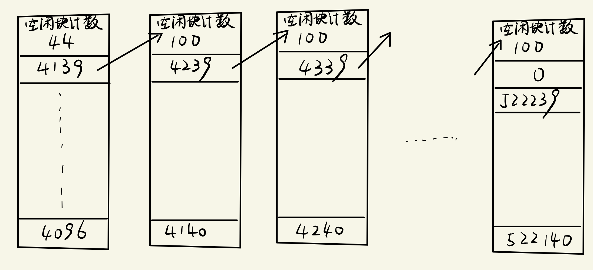

# 191180164 杨茂琛 作业5

## 7

### FCFS

$$
(143-86)+(147-86)+(147-91)+(177-91)+(177-94)+\\(150-94)+(150-102)+(175-102)+(175-130)=565
$$

143->86->147->91->177->94->150->102->175->130

### SSTF

$$
(147-143)+(150-147)+(150-130)+(130-102)+(102-94)+\\(94-91)+(91-86)+(175-86)+(177-175)=162
$$

143->147->150->130->102->94->91->86->175->177

### SCAN

扫描算法会先递增**走到尽头**，再递减返回到**最后一个请求**结束
$$
(147-143)+(150-147)+(175-150)+(177-175)+(199-177)+\\(199-130)+(130-102)+(102-94)+(94-91)+(91-86)=169
$$
143->147->150->175->177->199->130->102->94->91->86

### 电梯调度

刚刚完成125号柱面的请求，位于143号柱面，说明当前方向递增
$$
(147-143)+(150-147)+(175-150)+(177-175)+(177-130)+\\(130-102)+(102-94)+(94-91)+(91-86)=125
$$
143->147->150->175->177->130->102->94->91->86

## 13

~~题目应该错了吧，块间隔为0英寸那利用率不是100%吗，我在网上搜这道题，题目都是块间隔0.6英寸~~这里，假设块间隔为0.6英寸

### 1

块间隔相当于存放$0.6*800=480$个字符的大小

每条逻辑记录自成一组，那么利用率为$160/(160+480)=0.25$

### 2

占用空间相当于存放$1500*(160+480)=960000$个字符的大小，那么就是$960000/800=1200$英寸磁盘空间的大小

### 3

$$
\text{设}x\text{条记录成一组}\\
160x/(160x+480)=0.5\\
160x=80x+240\\
80x=240\\
x=3
$$

若使磁带空间利用率不低于50%，至少以3条逻辑记录为一组

## 15

### 凌乱存放

总查找时间：$100*13*6=7800$

总搜索延迟：$100*100=10000$

总传输时间：$100*25=2500$

总用时：$7800+10000+2500=20300\text{ms}=20.3\text{s}$

### 优化存放

总查找时间：$100*2*6=1200$

总搜索延迟：$100*100=10000$

总传输时间：$100*25=2500$

总用时：$1200+10000+2500=13700\text{ms}=13.7\text{s}$

## 21

考虑$T_3$与$T_1$的两种大小关系：

1. 若$T_1>T_3$，即将数据从磁盘送入缓冲区慢

那么，CPU将等待I/O

总用时$T=T_1+T_2=\max(T_1,T_3)+T_2$

又因为$T_2<<T_1$，$T=T_1$

2. 若$T_1<T_3$，即处理数据更慢

那么，I/O将等待CPU

总用时$T=T_2+T_3=T_2+\max(T_1,T_3)$

又因为$T_2<<T_1<T_3$，$T=T_3$

综上，$T=\max(T_1,T_3)$

## 22

减去用于存储inode等和对换所用的空间，还有$520-10-4=506\text{MB}=518144\text{KB}$

每100个盘块成一组，尚未使用的盘块形成$5182$组，从#4096到#522239

把少的44个盘块的组作为超级块

