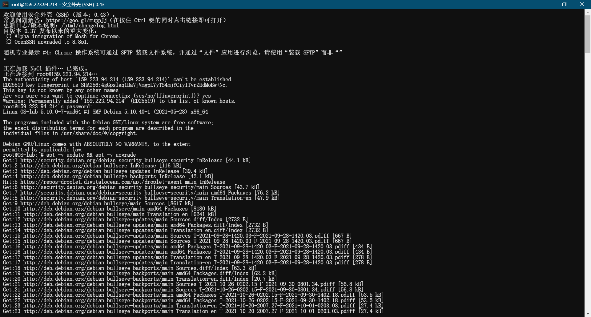
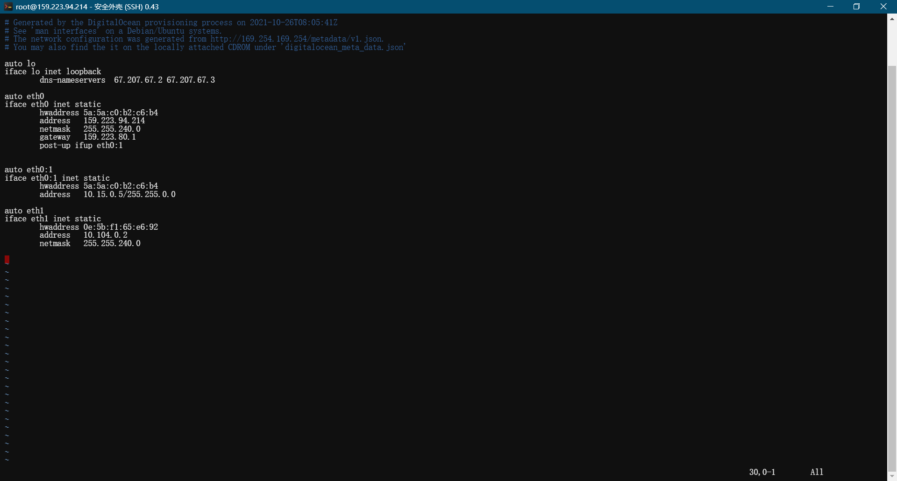
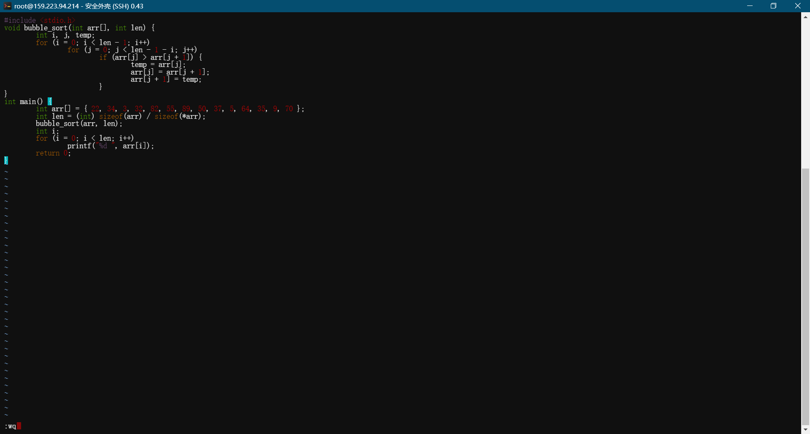
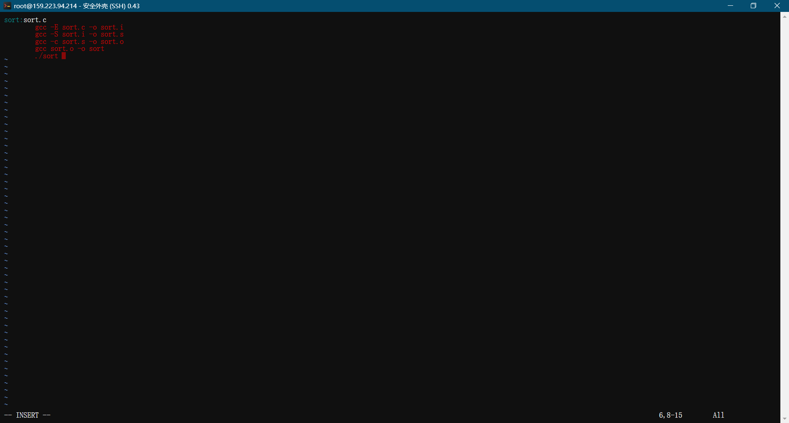

# Lab1 Linux常用命令及Makefile实验

> 杨茂琛 191180164

## 实验环境

- Windows 10 x64
- Debian 11 x64

## 实验内容

### 实现从Windows到所用Linux系统的远程连接
使用了`Google`提供的`Chrome`插件`Secure shell`透过`ssh`连接



### 使用 Linux Shell 命令完成以下操作：

#### 查看当前登录在系统中的用户列表、系统中的用户总数和系统启动时间。

使用命令`w`查看登录用户列表：

```
root@OS-lab:~# w
 08:20:03 up 14 min,  1 user,  load average: 0.03, 0.13, 0.07
USER     TTY      FROM             LOGIN@   IDLE   JCPU   PCPU WHAT
root     pts/0    202.119.42.186   08:15    0.00s  0.01s  0.00s w
```

使用命令`cat /etc/passwd | wc -l`查看用户数：

```
root@OS-lab:~# cat /etc/passwd | wc -l
28
```

使用命令`who -r`查看本次系统启动时刻：

```
root@OS-lab:~# who -r
         run-level 5  2021-10-26 08:05
```


#### 将系统文件 /etc/profile 复制到主用户目录，并改名为 profile.txt 查看此文件的内容，并对非空行进行编号；重新打开此文件， 从 profile 的第 5 行开始显示，每屏幕仅显示 5 行。

使用`cp`复制并重命名：

```
root@OS-lab:~# ls
root@OS-lab:~# cp /etc/profile profile.txt
root@OS-lab:~# ls
profile.txt
```

用`cat -b`查看编号后内容：

```
root@OS-lab:~# cat -b profile.txt 
     1  # /etc/profile: system-wide .profile file for the Bourne shell (sh(1))
     2  # and Bourne compatible shells (bash(1), ksh(1), ash(1), ...).

     3  if [ "$(id -u)" -eq 0 ]; then
     4    PATH="/usr/local/sbin:/usr/local/bin:/usr/sbin:/usr/bin:/sbin:/bin"
     5  else
     6    PATH="/usr/local/bin:/usr/bin:/bin:/usr/local/games:/usr/games"
     7  fi
     8  export PATH

     9  if [ "${PS1-}" ]; then
    10    if [ "${BASH-}" ] && [ "$BASH" != "/bin/sh" ]; then
    11      # The file bash.bashrc already sets the default PS1.
    12      # PS1='\h:\w\$ '
    13      if [ -f /etc/bash.bashrc ]; then
    14        . /etc/bash.bashrc
    15      fi
    16    else
    17      if [ "$(id -u)" -eq 0 ]; then
    18        PS1='# '
    19      else
    20        PS1='$ '
    21      fi
    22    fi
    23  fi

    24  if [ -d /etc/profile.d ]; then
    25    for i in /etc/profile.d/*.sh; do
    26      if [ -r $i ]; then
    27        . $i
    28      fi
    29    done
    30    unset i
    31  fi
```

使用`more -5 +5`来每次显示5行、从第5行开始显示：

```
root@OS-lab:~# more -5 +5 profile.txt 
  PATH="/usr/local/sbin:/usr/local/bin:/usr/sbin:/usr/bin:/sbin:/bin"
else
  PATH="/usr/local/bin:/usr/bin:/bin:/usr/local/games:/usr/games"
fi
export PATH

...skipping 1 line
if [ "${PS1-}" ]; then
  if [ "${BASH-}" ] && [ "$BASH" != "/bin/sh" ]; then
    # The file bash.bashrc already sets the default PS1.
    # PS1='\h:\w\$ '
    if [ -f /etc/bash.bashrc ]; then

...skipping 1 line
    fi
  else
    if [ "$(id -u)" -eq 0 ]; then
      PS1='# '
    else

...skipping 1 line
    fi
  fi
fi

if [ -d /etc/profile.d ]; then

...skipping 1 line
    if [ -r $i ]; then
      . $i
    fi
  done
  unset i

...skipping 1 line
```


#### 在主用户目录创建临时目录 tmp ，在此目下录， 将 etc 目录压缩成 etc.zip 文件，然后解压缩。
使用`mkdir`新建目录：

```
root@OS-lab:~# mkdir tmp
root@OS-lab:~# ls
profile.txt  tmp
```

使用`apt install`安装`zip`：

```
root@OS-lab:~# apt -y install zip
Reading package lists... Done
Building dependency tree... Done
Reading state information... Done
The following additional packages will be installed:
  unzip
The following NEW packages will be installed:
  unzip zip
0 upgraded, 2 newly installed, 0 to remove and 0 not upgraded.
Need to get 403 kB of archives.
After this operation, 1032 kB of additional disk space will be used.
Get:1 http://deb.debian.org/debian bullseye/main amd64 unzip amd64 6.0-26 [171 kB]
Get:2 http://deb.debian.org/debian bullseye/main amd64 zip amd64 3.0-12 [232 kB]
Fetched 403 kB in 0s (23.4 MB/s)
Selecting previously unselected package unzip.
(Reading database ... 29867 files and directories currently installed.)
Preparing to unpack .../unzip_6.0-26_amd64.deb ...
Unpacking unzip (6.0-26) ...
Selecting previously unselected package zip.
Preparing to unpack .../archives/zip_3.0-12_amd64.deb ...
Unpacking zip (3.0-12) ...
Setting up unzip (6.0-26) ...
Setting up zip (3.0-12) ...
Processing triggers for man-db (2.9.4-2) ...
```

使用`zip`压缩：

```
root@OS-lab:~/tmp# zip -q  -r etc.zip /etc
root@OS-lab:~/tmp# ls
etc.zip
```

使用`unzip`解压缩：

```
root@OS-lab:~/tmp# unzip -q etc.zip 
root@OS-lab:~/tmp# ls
etc  etc.zip
```


#### 查找 /etc 目录下包含字符串 ss ”的文件；复制 /etc/pa sswd 文件到用户的主目录下，搜索这个文件中包含字符串“ root ”的行，并显示行号。
使用`grep ss /etc/*`查找，不使用`-r`参数递归查找（部分结果）：

```
root@OS-lab:~# grep ss /etc/*
grep: /etc/NetworkManager: Is a directory
grep: /etc/X11: Is a directory
/etc/adduser.conf:# Please note that system software, such as the users allocated by the base-passwd
/etc/adduser.conf:# package, may assume that UIDs less than 100 are unallocated.
/etc/adduser.conf:# no longer do this per default. If you want it nevertheless you can
/etc/adduser.conf:# regular expression when creating a new home directory
/etc/adduser.conf:# check user and group names also against this regular expression.
grep: /etc/alternatives: Is a directory
grep: /etc/apparmor: Is a directory
grep: /etc/apparmor.d: Is a directory
grep: /etc/apt: Is a directory
/etc/bash.bashrc:# check the window size after each command and, if necessary,
/etc/bash.bashrc:# but only if not SUDOing and have SUDO_PS1 set; then assume smart user.
/etc/bindresvport.blacklist:774 # rpasswd
grep: /etc/binfmt.d: Is a directory
grep: /etc/ca-certificates: Is a directory
/etc/ca-certificates.conf:# installed in /etc/ssl/certs.
/etc/ca-certificates.conf:# update-ca-certificates(8) will update /etc/ssl/certs by reading this file.
/etc/ca-certificates.conf:mozilla/Buypass_Class_2_Root_CA.crt
```

用`cp`复制：

```
root@OS-lab:~# cp /etc/passwd passwd
root@OS-lab:~# ls
passwd  profile.txt  tmp
```

使用`grep -n`显示行号：

```
root@OS-lab:~# grep -n root passwd
1:root:x:0:0:root:/root:/bin/bash
```


#### 创建一个新用户 user 1 ，给该用户设置密码为 LoveLinux ，将用户名更改为 user2 。 创建user3, 将 user 3 的有效组切换为 admin 。 切换到 user3 在 /home 目录下创建 di r 目录 。 切
换到 user 2 查看 user 2 是否可以在 dir 目录下创建、删除文件。如果不可以修改这个目
录的 权限，或者修改这个目录的所有者、所属组，使得用户 user2 可以在这个目录下创
建、删除文件。
```
root@OS-lab:~# useradd user1
root@OS-lab:~# passwd user1
New password: 
Retype new password: 
passwd: password updated successfully
root@OS-lab:~# usermod -l user2 user1
root@OS-lab:~# useradd -d /home/dir -m user3
root@OS-lab:~# groupadd admin
root@OS-lab:~# usermod -g admin user3
root@OS-lab:~# su user2
$ cd /home/dir
$ mkdir try
mkdir: cannot create directory ‘try’: Permission denied
$  su root
Password: 
root@OS-lab:/home/dir# chmod 777 /home/dir
root@OS-lab:/home/dir# su user2
$ cd /home/dir
$ mkdir try
$ 
```


#### 完全 使用命令下载、 安装 、运行并卸载 Linux 版本的 QQ

在QQ官网找到https://im.qq.com/linuxqq/download.html下载地址：

```
https://down.qq.com/qqweb/LinuxQQ/linuxqq_2.0.0-b2-1089_amd64.deb
```

用`curl -O`下载deb文件：

```
root@OS-lab:~# curl -O https://down.qq.com/qqweb/LinuxQQ/linuxqq_2.0.0-b2-1089_amd64.deb
  % Total    % Received % Xferd  Average Speed   Time    Time     Time  Current
                                 Dload  Upload   Total   Spent    Left  Speed
100 11.8M  100 11.8M    0     0  2808k      0  0:00:04  0:00:04 --:--:-- 2808k
```

用`dpkg -i`安装：

```
root@OS-lab:~# dpkg -i linuxqq_2.0.0-b2-1089_amd64.deb 
Selecting previously unselected package linuxqq.
(Reading database ... 29900 files and directories currently installed.)
Preparing to unpack linuxqq_2.0.0-b2-1089_amd64.deb ...
Unpacking linuxqq (2.0.0-b2) ...
Setting up linuxqq (2.0.0-b2) ...
```

直接使用`qq`运行：

```
root@OS-lab:~# qq
qq: error while loading shared libraries: libX11.so.6: cannot open shared object file: No such file or directory
```

用`dpkg -r`卸载软件：

```
root@OS-lab:~# dpkg -r linuxqq
(Reading database ... 29912 files and directories currently installed.)
Removing linuxqq (2.0.0-b2) ...
dpkg: warning: while removing linuxqq, directory '/usr/local/share' not empty so not removed
dpkg: warning: while removing linuxqq, directory '/usr/local/lib' not empty so not removed
root@OS-lab:~# 
```


#### 查看网络适配器的网络设置，将 dhcp 动态 IP 的设置方式改为 static 静态 IP 的设置方式；查看当前系统服务端口的监 听状态。

使用命令`ifconfig`查看网卡信息：

```
root@OS-lab:~# ifconfig
eth0: flags=4163<UP,BROADCAST,RUNNING,MULTICAST>  mtu 1500
        inet 159.223.94.214  netmask 255.255.240.0  broadcast 159.223.95.255
        inet6 fe80::585a:c0ff:feb2:c6b4  prefixlen 64  scopeid 0x20<link>
        ether 5a:5a:c0:b2:c6:b4  txqueuelen 1000  (Ethernet)
        RX packets 50184  bytes 144990292 (138.2 MiB)
        RX errors 0  dropped 0  overruns 0  frame 0
        TX packets 45299  bytes 4880709 (4.6 MiB)
        TX errors 0  dropped 0 overruns 0  carrier 0  collisions 0

eth0:1: flags=4163<UP,BROADCAST,RUNNING,MULTICAST>  mtu 1500
        inet 10.15.0.5  netmask 255.255.0.0  broadcast 10.15.255.255
        ether 5a:5a:c0:b2:c6:b4  txqueuelen 1000  (Ethernet)

eth1: flags=4163<UP,BROADCAST,RUNNING,MULTICAST>  mtu 1500
        inet 10.104.0.2  netmask 255.255.240.0  broadcast 10.104.15.255
        inet6 fe80::c5b:f1ff:fe65:e692  prefixlen 64  scopeid 0x20<link>
        ether 0e:5b:f1:65:e6:92  txqueuelen 1000  (Ethernet)
        RX packets 39  bytes 2806 (2.7 KiB)
        RX errors 0  dropped 0  overruns 0  frame 0
        TX packets 40  bytes 2896 (2.8 KiB)
        TX errors 0  dropped 0 overruns 0  carrier 0  collisions 0

lo: flags=73<UP,LOOPBACK,RUNNING>  mtu 65536
        inet 127.0.0.1  netmask 255.0.0.0
        inet6 ::1  prefixlen 128  scopeid 0x10<host>
        loop  txqueuelen 1000  (Local Loopback)
        RX packets 12  bytes 600 (600.0 B)
        RX errors 0  dropped 0  overruns 0  frame 0
        TX packets 12  bytes 600 (600.0 B)
        TX errors 0  dropped 0 overruns 0  carrier 0  collisions 0

```

直接修改dhcp的配置`vi /etc/network/interfaces`：



用`netstat -nlp |grep LISTEN`配合`grep`显示监听的端口：

```
root@OS-lab:/etc# netstat -nlp |grep LISTEN
tcp        0      0 0.0.0.0:22              0.0.0.0:*               LISTEN      628/sshd: /usr/sbin 
tcp6       0      0 :::22                   :::*                    LISTEN      628/sshd: /usr/sbin 
unix  2      [ ACC ]     STREAM     LISTENING     12781    1/systemd            /run/dbus/system_bus_socket
unix  2      [ ACC ]     STREAM     LISTENING     80094    18174/systemd        /run/user/0/systemd/private
unix  2      [ ACC ]     STREAM     LISTENING     80101    18174/systemd        /run/user/0/gnupg/S.dirmngr
unix  2      [ ACC ]     STREAM     LISTENING     80103    18174/systemd        /run/user/0/gnupg/S.gpg-agent.browser
unix  2      [ ACC ]     STREAM     LISTENING     80105    18174/systemd        /run/user/0/gnupg/S.gpg-agent.extra
unix  2      [ ACC ]     STREAM     LISTENING     80107    18174/systemd        /run/user/0/gnupg/S.gpg-agent.ssh
unix  2      [ ACC ]     STREAM     LISTENING     80109    18174/systemd        /run/user/0/gnupg/S.gpg-agent
unix  2      [ ACC ]     STREAM     LISTENING     21908    1/systemd            /run/uuidd/request
unix  2      [ ACC ]     STREAM     LISTENING     10679    1/systemd            /run/systemd/fsck.progress
unix  2      [ ACC ]     STREAM     LISTENING     10687    1/systemd            /run/systemd/journal/stdout
unix  2      [ ACC ]     SEQPACKET  LISTENING     10689    1/systemd            /run/udev/control
unix  2      [ ACC ]     STREAM     LISTENING     24364    1/systemd            /run/systemd/private
unix  2      [ ACC ]     STREAM     LISTENING     24368    1/systemd            /run/systemd/userdb/io.systemd.DynamicUser
unix  2      [ ACC ]     STREAM     LISTENING     24369    1/systemd            /run/systemd/io.system.ManagedOOM
unix  2      [ ACC ]     STREAM     LISTENING     24400    8093/systemd-journa  /run/systemd/journal/io.systemd.journal
```


#### 插入 u 盘，在 /mnt 下建立一个名叫 USB 的文件夹 然后将 u 盘挂载到 /mnt/USB 下，在此目录下创建一个 temp.txt 文件，然后卸载 u 盘。
挂载的目标路径必须存在：

```
root@OS-lab:/etc# cd /mnt
root@OS-lab:/mnt# ls
root@OS-lab:/mnt# mkdir USB
root@OS-lab:/mnt# ls
USB
```

用`mount`命令挂载，假设U盘目录为`/dev/sta1`：

```
$ mount /dev/sta1 /mnt/USB
```

使用`unmount`命令卸载：

```
$ unmount /mnt/USB
```

### Makefile 实验

#### 请自行查找资料，阅读 Makefile 相关资料， 了解 Makefile 的基本概念和基本结构，初步掌握编写简单 Makefile 的方法，了解递归 Make 的编译过程，初步掌握利用 GNU Make
编译应用程序的方法。推荐阅读： makefile 教程（中文版）， 陈皓著
我主要选择以下阅读材料：

- https://seisman.github.io/how-to-write-makefile/introduction.html
- https://www.ruanyifeng.com/blog/2015/02/make.html


#### gcc&gdb实践

##### 利用文本编辑器 vi 编写一种排序算法 sort .c ，对一个数组中的整数进行排序




##### 利用 gcc 手 动编译、运行该程序

预处理：

```
root@OS-lab:~# gcc -E sort.c -o sort.i
```

编译：

```
root@OS-lab:~# gcc -S sort.i -o sort.s
```

汇编：

```
root@OS-lab:~# gcc -c sort.s -o sort.o
```

链接：

```
root@OS-lab:~# gcc sort.o -o sort
```

运行：

```
root@OS-lab:~# ./sort
3 5 9 22 32 34 35 37 50 55 64 70 82 89 
```


##### 利用 gdb 手动加入断点进行调试，在屏幕上打印断点信息，以及任何一个变量的值。

重新带上`-g`参数编译：

```
root@OS-lab:~# gcc -g sort.c -o sort
```

用`gdb sort`编译：

```
root@OS-lab:~# gdb sort
```

在源代码的第5行打断点：

```
(gdb) b sort.c:5
Breakpoint 1 at 0x114c: file sort.c, line 5.
```

用`run(r)`运行：

```
(gdb) r
Starting program: /root/sort 

Breakpoint 1, bubble_sort (arr=0x7fffffffeae0, len=14) at sort.c:5
5                       for (j = 0; j < len - 1 - i; j++)
```

用`p`打印变量等：

```
(gdb) p len
$1 = 14
```

用`q`退出调试：

```
(gdb) q
A debugging session is active.

        Inferior 1 [process 22859] will be killed.

Quit anyway? (y or n) y
```


#### 针对 sort.c 利用文本编辑器创建一个 makefile 文件，通过 make 编译次程序，并运行 。

简单写个Makefile：



直接`make sort`：

```
root@OS-lab:~# make sort
gcc -E sort.c -o sort.i
gcc -S sort.i -o sort.s
gcc -c sort.s -o sort.o
gcc sort.o -o sort
./sort
3 5 9 22 32 34 35 37 50 55 64 70 82 89 
```


#### 线程编程实践

##### sort.c

```c
#include <stdio.h>
#include <unistd.h>
void bubble_sort(int arr[], int len) {
        int i, j, temp;
        for (i = 0; i < len - 1; i++)
                for (j = 0; j < len - 1 - i; j++)
                        if (arr[j] > arr[j + 1]) {
                                temp = arr[j];
                                arr[j] = arr[j + 1];
                                arr[j + 1] = temp;
                        }
}
int main() {
        // int arr[] = { 22, 34, 3, 32, 82, 55, 89, 50, 37, 5, 64, 35, 9, 70 };
        // int len = (int) sizeof(arr) / sizeof(*arr);
        int arr[15] = { 22, 34, 3, 32, 82, 55, 89, 50, 37, 5, 64, 35, 9, 70 };
        int len = 14;
        pid_t val;
        bubble_sort(arr, len);
        int i;
        for (i = 0; i < len; i++)
                printf("%d ", arr[i]);
        if (val = fork()) {
            printf("%x", &arr[0]);
            sleep(5);
        }
        else {
            insert(arr, 15, 39);
            printf("%x", &arr[0]);
        }
        return 0;
}
```

##### insert.c

```c
void insert(int a[], int len, int x) {
    int i;
    for (i = len - 1; i >= 0; i--) {
        if (x > a[i]) {
            a[i+1] = x;
            break;
        }
        else {
            a[i+1] = a[i];
        }
    }
}
```

##### Makefile

```makefile
sort:sort.c insert.c
    gcc sort.c insert.c -o sort
    ./sort
```

运行可得：

```
root@OS-lab:~# make sort
gcc sort.c insert.c -o sort
sort.c: In function ‘main’:
sort.c:28:13: warning: implicit declaration of function ‘insert’ [-Wimplicit-function-declaration]
   28 |             insert(arr, 15, 39);
      |             ^~~~~~
./sort
3 5 9 22 32 34 35 37 50 55 64 70 82 89 b62fe5e03 5 9 22 32 34 35 37 50 55 64 70 82 89 b62fe5e0
```

运行中出现了一个警告。

阅读可以知道是在`sort.c`中我没有显式地声明`insert`这个函数，所以在编译时候报了错误。

但是我确实也有`insert`函数所以在链接阶段成功进行了链接，得以正常运行。

